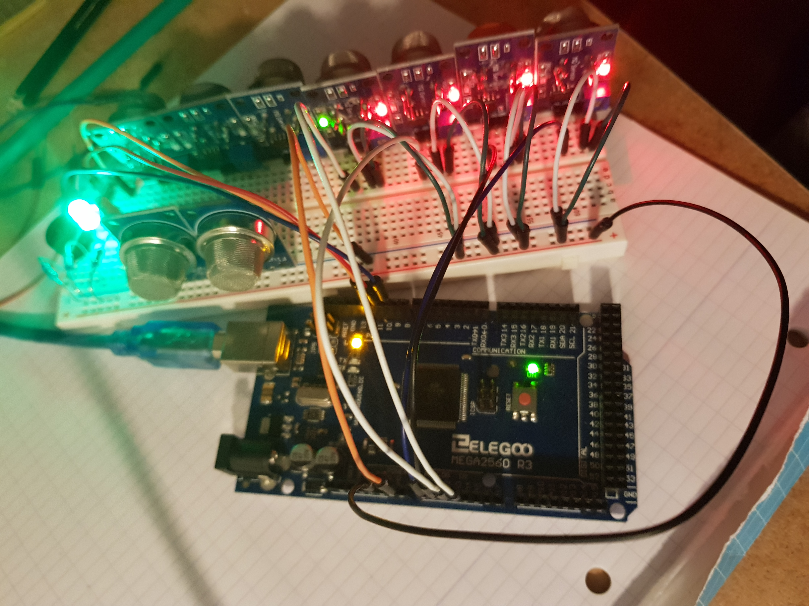

# Arduino

## Sketchbook

+ [DHTsensor](sketchbook/DHTsensor/DHTsensor.ino)  

+ [GOPROcam](sketchbook/GOPROcam/GOPROcam.ino)  

+ [MQsensor](sketchbook/MQsensor/MQsensor.ino)  
  

>

## Boards

+ [Yún Rev. 2](https://www.arduino.cc/en/Guide/ArduinoYunRev2#toc22)
+ [ATmega2560](https://www.arduino.cc/en/pmwiki.php?n=Main/arduinoBoardMega2560)
+ [MKR WiFi 1010](https://docs.arduino.cc/hardware/mkr-wifi-1010)

<!-- ## Tutoriels avancement

+ SENSOR KIT : 58/332
+ STARTER KIT : 96/217 -->

## Linux installation

+ Installation portable : [https://www.arduino.cc/en/Guide/PortableIDE](https://www.arduino.cc/en/Guide/PortableIDE)  
+ Téléchargement : [https://www.arduino.cc/en/Main/Software](https://www.arduino.cc/en/Main/Software)  
+ Installation à partir des dépots : [https://doc.ubuntu-fr.org/arduino](https://doc.ubuntu-fr.org/arduino)  
```
sudo apt-get update
sudo apt-get install arduino            (installer arduino présent dans les dépots Universe d'Ubuntu)
sudo apt-get install arduino-mk         (programmer Arduino en ligne de commandes)
sudo apt-get remove arduino arduino-mk  (suppression des paquets Arduino)
sudo apt autoremove                     (supprimer les dépendances installées)
```
+ Installation en dur : [https://vitux.com/how-to-install-arduino-ide-on-ubuntu](https://vitux.com/how-to-install-arduino-ide-on-ubuntu)
```
cd /home/$USER/Téléchargements/
tar -xf arduino-1.8.12-linux64.tar.xz   (décompresser le dossier d'archives)
cd arduino-1.8.12/
mkdir /home/$USER/Bureau/Arduino/arduino-1.8.12/portable
mkdir /home/$USER/Bureau/Arduino/arduino-1.8.12/portable/sketchbook
mkdir /home/$USER/Bureau/Arduino/arduino-1.8.12/portable/staging
mkdir /home/$USER/Bureau/Arduino/arduino-1.8.12/portable/packages
./arduino   (portable execution)   ou   sudo ./install.sh   (installation)
```

<!-- ## Drone experimentation
[Drone assemblage](https://www.robotshop.com/community/blog/show/comment-fabriquer-un-droneuav-lecon-5-assemblage) -->